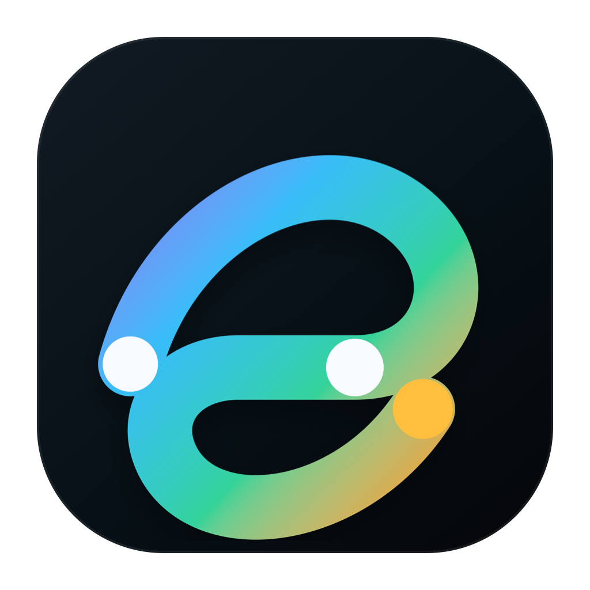

# Session Recall

<p align="center">
  
</p>

Session Recall is a local Codex plugin for finding old conversations from fuzzy memory. It indexes your local Codex session history, expands vague searches with aliases and language variants, and returns readable matches with snippets, metadata, confidence, and match reasons.

The plugin is local-first. It reads session files from your own `~/.codex` directory and stores a local SQLite index under `~/.codex/session-recall/`.

## Features

- Search local Codex session history by remembered content.
- Expand vague searches with aliases, punctuation variants, and language variants.
- Return readable results with title, project, time, archived status, snippet, confidence, and why it matched.
- Use fast keyword search by default, with smart and hybrid fallback modes for fuzzier memories.
- Reopen or continue the original session from the returned thread metadata.

## Installation

### Ask Codex To Install It

Send the following message to Codex:

```text
Please install the Session Recall Codex plugin from https://github.com/Davidyooo/session-recall.git.
Clone the repository into ~/plugins/session-recall, verify that .codex-plugin/plugin.json exists,
add the plugin to the personal marketplace, run codex plugin marketplace add ~,
then run codex plugin add session-recall@personal.
After installing, validate the plugin and tell me whether I should start a new conversation to load the new skill and MCP tools.
```

### Manual Install

Clone the plugin into the default location referenced by the Codex personal marketplace:

```bash
mkdir -p ~/plugins
git clone https://github.com/Davidyooo/session-recall.git ~/plugins/session-recall
cd ~/plugins/session-recall
python3 -m py_compile scripts/session_recall_mcp.py
```

Make sure `~/.agents/plugins/marketplace.json` contains a Session Recall entry:

```json
{
  "name": "personal",
  "interface": {
    "displayName": "Personal"
  },
  "plugins": [
    {
      "name": "session-recall",
      "source": {
        "source": "local",
        "path": "./plugins/session-recall"
      },
      "policy": {
        "installation": "AVAILABLE",
        "authentication": "ON_INSTALL"
      },
      "category": "Productivity"
    }
  ]
}
```

Then register the personal marketplace and install the plugin:

```bash
codex plugin marketplace add ~
codex plugin add session-recall@personal
```

After installing, start a new Codex conversation so the new skill and MCP tools are loaded cleanly.

## Usage

Ask Codex:

```text
Use Session Recall to find my old Aside browser conversation.
```

Session Recall can expand that into searches such as:

- `Aside browser`
- `Aside AI Browser`
- `aside browser`
- `Aside Discord`

Then it returns likely sessions and explains why each result matched.

## Tools

- `refresh_index`: refresh the local session index.
- `search_sessions`: search one query exactly, smartly, or with hybrid mode.
- `search_many_sessions`: merge several query variants; defaults to fast expanded keyword search.
- `get_session`: read selected excerpts from a matched session.

## Privacy

Session Recall does not upload your sessions. It reads local Codex session files and writes a local index to:

```text
~/.codex/session-recall/index.sqlite
```

Do not share that SQLite index or your local session files.

## Local Development

Run a quick syntax check:

```bash
python3 -m py_compile scripts/session_recall_mcp.py
```

The MCP server entry point is:

```text
scripts/session_recall_mcp.py
```

Useful paths:

- `.codex-plugin/plugin.json`: plugin metadata shown in Codex.
- `.mcp.json`: MCP server configuration.
- `skills/session-recall/SKILL.md`: assistant-facing workflow instructions.
- `assets/`: logo and icon files used by the plugin UI.

## Limits

- This is not embedding or vector search.
- Very fuzzy memories may still need a follow-up keyword.
- It searches saved local Codex sessions; it does not recover unsaved ephemeral chats.

## Developer

David Citro
